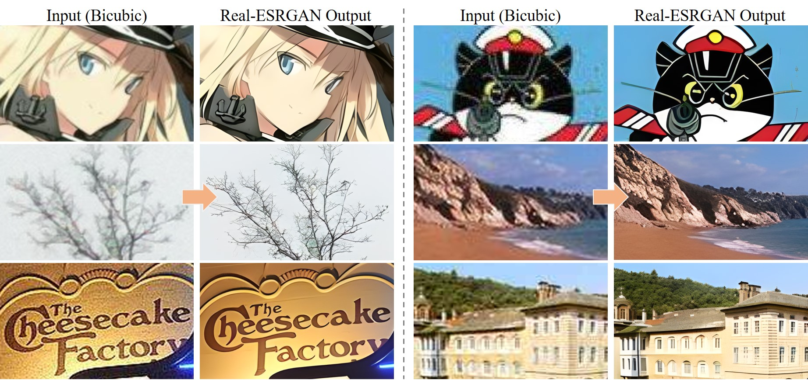

<p align="center">
  
</p>

## <div align="center"><b><a href="README.md">English</a> | <a href="README_CN.md">简体中文</a></b></div>

[](https://github.com/xinntao/Real-ESRGAN/releases)
[](https://pypi.org/project/realesrgan/)
[](https://github.com/xinntao/Real-ESRGAN/issues)
[](https://github.com/xinntao/Real-ESRGAN/issues)
[](https://github.com/xinntao/Real-ESRGAN/blob/master/LICENSE)
[](https://github.com/xinntao/Real-ESRGAN/blob/master/.github/workflows/publish-pip.yml)

:fire: 更新动漫视频的小模型 **RealESRGAN AnimeVideo-v3**. 更多信息在 [[动漫视频模型介绍](docs/anime_video_model.md)] 和 [[比较](docs/anime_comparisons_CN.md)] 中.

1. Real-ESRGAN的[Colab Demo](https://colab.research.google.com/drive/1k2Zod6kSHEvraybHl50Lys0LerhyTMCo?usp=sharing) | Real-ESRGAN**动漫视频** 的[Colab Demo](https://colab.research.google.com/drive/1yNl9ORUxxlL4N0keJa2SEPB61imPQd1B?usp=sharing)
2. **支持Intel/AMD/Nvidia显卡**的绿色版exe文件： [Windows版](https://github.com/xinntao/Real-ESRGAN/releases/download/v0.2.5.0/realesrgan-ncnn-vulkan-20220424-windows.zip) / [Linux版](https://github.com/xinntao/Real-ESRGAN/releases/download/v0.2.5.0/realesrgan-ncnn-vulkan-20220424-ubuntu.zip) / [macOS版](https://github.com/xinntao/Real-ESRGAN/releases/download/v0.2.5.0/realesrgan-ncnn-vulkan-20220424-macos.zip)，详情请移步[这里](#便携版（绿色版）可执行文件)。NCNN的实现在 [Real-ESRGAN-ncnn-vulkan](https://github.com/xinntao/Real-ESRGAN-ncnn-vulkan)。

Real-ESRGAN 的目标是开发出**实用的图像/视频修复算法**。<br>
我们在 ESRGAN 的基础上使用纯合成的数据来进行训练，以使其能被应用于实际的图片修复的场景（顾名思义：Real-ESRGAN）。

:art: Real-ESRGAN 需要，也很欢迎你的贡献，如新功能、模型、bug修复、建议、维护等等。详情可以查看[CONTRIBUTING.md](docs/CONTRIBUTING.md)，所有的贡献者都会被列在[此处](README_CN.md#hugs-感谢)。

:milky_way: 感谢大家提供了很好的反馈。这些反馈会逐步更新在 [这个文档](docs/feedback.md)。

:question: 常见的问题可以在[FAQ.md](docs/FAQ.md)中找到答案。（好吧，现在还是空白的=-=||）

---

如果 Real-ESRGAN 对你有帮助，可以给本项目一个 Star :star: ，或者推荐给你的朋友们，谢谢！:blush: <br/>
其他推荐的项目：<br/>
:arrow_forward: [GFPGAN](https://github.com/TencentARC/GFPGAN): 实用的人脸复原算法 <br>
:arrow_forward: [BasicSR](https://github.com/xinntao/BasicSR): 开源的图像和视频工具箱<br>
:arrow_forward: [facexlib](https://github.com/xinntao/facexlib): 提供与人脸相关的工具箱<br>
:arrow_forward: [HandyView](https://github.com/xinntao/HandyView): 基于PyQt5的图片查看器，方便查看以及比较 <br>

---

<!---------------------------------- Updates --------------------------->
<details>
<summary>🚩<b>更新</b></summary>

- ✅ 更新动漫视频的小模型 **RealESRGAN AnimeVideo-v3**. 更多信息在 [anime video models](docs/anime_video_model.md) 和 [comparisons](docs/anime_comparisons.md)中.
- ✅ 添加了针对动漫视频的小模型, 更多信息在 [anime video models](docs/anime_video_model.md) 中.
- ✅ 添加了ncnn 实现：[Real-ESRGAN-ncnn-vulkan](https://github.com/xinntao/Real-ESRGAN-ncnn-vulkan).
- ✅ 添加了 [*RealESRGAN_x4plus_anime_6B.pth*](https://github.com/xinntao/Real-ESRGAN/releases/download/v0.2.2.4/RealESRGAN_x4plus_anime_6B.pth)，对二次元图片进行了优化，并减少了model的大小。详情 以及 与[waifu2x](https://github.com/nihui/waifu2x-ncnn-vulkan)的对比请查看[**anime_model.md**](docs/anime_model.md)
- ✅支持用户在自己的数据上进行微调 (finetune)：[详情](docs/Training.md#Finetune-Real-ESRGAN-on-your-own-dataset)
- ✅ 支持使用[GFPGAN](https://github.com/TencentARC/GFPGAN)**增强人脸**
- ✅ 通过[Gradio](https://github.com/gradio-app/gradio)添加到了[Huggingface Spaces](https://huggingface.co/spaces)（一个机器学习应用的在线平台）：[Gradio在线版](https://huggingface.co/spaces/akhaliq/Real-ESRGAN)。感谢[@AK391](https://github.com/AK391)
- ✅ 支持任意比例的缩放：`--outscale`（实际上使用`LANCZOS4`来更进一步调整输出图像的尺寸）。添加了*RealESRGAN_x2plus.pth*模型
- ✅ [推断脚本](inference_realesrgan.py)支持: 1) 分块处理**tile**; 2) 带**alpha通道**的图像; 3) **灰色**图像; 4) **16-bit**图像.
- ✅ 训练代码已经发布，具体做法可查看：[Training.md](docs/Training.md)。

</details>

<!---------------------------------- Projects that use Real-ESRGAN --------------------------->
<details>
<summary>🧩<b>使用Real-ESRGAN的项目</b></summary>

&nbsp;&nbsp;&nbsp;&nbsp;👋 如果你开发/使用/集成了Real-ESRGAN, 欢迎联系我添加

- NCNN-Android: [RealSR-NCNN-Android](https://github.com/tumuyan/RealSR-NCNN-Android) by [tumuyan](https://github.com/tumuyan)
- VapourSynth: [vs-realesrgan](https://github.com/HolyWu/vs-realesrgan) by [HolyWu](https://github.com/HolyWu)
- NCNN: [Real-ESRGAN-ncnn-vulkan](https://github.com/xinntao/Real-ESRGAN-ncnn-vulkan)

&nbsp;&nbsp;&nbsp;&nbsp;**易用的图形界面**

- [Waifu2x-Extension-GUI](https://github.com/AaronFeng753/Waifu2x-Extension-GUI) by [AaronFeng753](https://github.com/AaronFeng753)
- [Squirrel-RIFE](https://github.com/Justin62628/Squirrel-RIFE) by [Justin62628](https://github.com/Justin62628)
- [Real-GUI](https://github.com/scifx/Real-GUI) by [scifx](https://github.com/scifx)
- [Real-ESRGAN_GUI](https://github.com/net2cn/Real-ESRGAN_GUI) by [net2cn](https://github.com/net2cn)
- [Real-ESRGAN-EGUI](https://github.com/WGzeyu/Real-ESRGAN-EGUI) by [WGzeyu](https://github.com/WGzeyu)
- [anime_upscaler](https://github.com/shangar21/anime_upscaler) by [shangar21](https://github.com/shangar21)
- [RealESRGAN-GUI](https://github.com/Baiyuetribe/paper2gui/blob/main/Video%20Super%20Resolution/RealESRGAN-GUI.md) by [Baiyuetribe](https://github.com/Baiyuetribe)

</details>

<details>
<summary>👀<b>Demo视频（B站）</b></summary>

- [大闹天宫片段](https://www.bilibili.com/video/BV1ja41117zb)

</details>

### :book: Real-ESRGAN: Training Real-World Blind Super-Resolution with Pure Synthetic Data

> [[论文](https://arxiv.org/abs/2107.10833)] &emsp; [项目主页] &emsp; [[YouTube 视频](https://www.youtube.com/watch?v=fxHWoDSSvSc)] &emsp; [[B站视频](https://www.bilibili.com/video/BV1H34y1m7sS/)] &emsp; [[Poster](https://xinntao.github.io/projects/RealESRGAN_src/RealESRGAN_poster.pdf)] &emsp; [[PPT](https://docs.google.com/presentation/d/1QtW6Iy8rm8rGLsJ0Ldti6kP-7Qyzy6XL/edit?usp=sharing&ouid=109799856763657548160&rtpof=true&sd=true)]<br>
> [Xintao Wang](https://xinntao.github.io/), Liangbin Xie, [Chao Dong](https://scholar.google.com.hk/citations?user=OSDCB0UAAAAJ), [Ying Shan](https://scholar.google.com/citations?user=4oXBp9UAAAAJ&hl=en) <br>
> Tencent ARC Lab; Shenzhen Institutes of Advanced Technology, Chinese Academy of Sciences

<p align="center">
  
</p>

---

我们提供了一套训练好的模型（*RealESRGAN_x4plus.pth*)，可以进行4倍的超分辨率。<br>
**现在的 Real-ESRGAN 还是有几率失败的，因为现实生活的降质过程比较复杂。**<br>
而且，本项目对**人脸以及文字之类**的效果还不是太好，但是我们会持续进行优化的。<br>

Real-ESRGAN 将会被长期支持，我会在空闲的时间中持续维护更新。

这些是未来计划的几个新功能：

- [ ] 优化人脸
- [ ] 优化文字
- [x] 优化动画图像
- [ ] 支持更多的超分辨率比例
- [ ] 可调节的复原

如果你有好主意或需求，欢迎在 issue 或 discussion 中提出。<br/>
如果你有一些 Real-ESRGAN 中有问题的照片，你也可以在 issue 或者 discussion 中发出来。我会留意（但是不一定能解决:stuck_out_tongue:）。如果有必要的话，我还会专门开一页来记录那些有待解决的图像。

---

### 便携版（绿色版）可执行文件

你可以下载**支持Intel/AMD/Nvidia显卡**的绿色版exe文件： [Windows版](https://github.com/xinntao/Real-ESRGAN/releases/download/v0.2.5.0/realesrgan-ncnn-vulkan-20220424-windows.zip) / [Linux版](https://github.com/xinntao/Real-ESRGAN/releases/download/v0.2.5.0/realesrgan-ncnn-vulkan-20220424-ubuntu.zip) / [macOS版](https://github.com/xinntao/Real-ESRGAN/releases/download/v0.2.5.0/realesrgan-ncnn-vulkan-20220424-macos.zip)。

绿色版指的是这些exe你可以直接运行（放U盘里拷走都没问题），因为里面已经有所需的文件和模型了。它不需要 CUDA 或者 PyTorch运行环境。<br>

你可以通过下面这个命令来运行（Windows版本的例子，更多信息请查看对应版本的README.md）：

```bash
./realesrgan-ncnn-vulkan.exe -i 输入图像.jpg -o 输出图像.png -n 模型名字
```

我们提供了五种模型：

1. realesrgan-x4plus（默认）
2. reaesrnet-x4plus
3. realesrgan-x4plus-anime（针对动漫插画图像优化，有更小的体积）
4. realesr-animevideov3 (针对动漫视频)

你可以通过`-n`参数来使用其他模型，例如`./realesrgan-ncnn-vulkan.exe -i 二次元图片.jpg -o 二刺螈图片.png -n realesrgan-x4plus-anime`

### 可执行文件的用法

1. 更多细节可以参考 [Real-ESRGAN-ncnn-vulkan](https://github.com/xinntao/Real-ESRGAN-ncnn-vulkan#computer-usages).
2. 注意：可执行文件并没有支持 python 脚本 `inference_realesrgan.py` 中所有的功能，比如 `outscale` 选项) .

```console
Usage: realesrgan-ncnn-vulkan.exe -i infile -o outfile [options]...

  -h                   show this help
  -i input-path        input image path (jpg/png/webp) or directory
  -o output-path       output image path (jpg/png/webp) or directory
  -s scale             upscale ratio (can be 2, 3, 4. default=4)
  -t tile-size         tile size (>=32/0=auto, default=0) can be 0,0,0 for multi-gpu
  -m model-path        folder path to the pre-trained models. default=models
  -n model-name        model name (default=realesr-animevideov3, can be realesr-animevideov3 | realesrgan-x4plus | realesrgan-x4plus-anime | realesrnet-x4plus)
  -g gpu-id            gpu device to use (default=auto) can be 0,1,2 for multi-gpu
  -j load:proc:save    thread count for load/proc/save (default=1:2:2) can be 1:2,2,2:2 for multi-gpu
  -x                   enable tta mode"
  -f format            output image format (jpg/png/webp, default=ext/png)
  -v                   verbose output
```

由于这些exe文件会把图像分成几个板块，然后来分别进行处理，再合成导出，输出的图像可能会有一点割裂感（而且可能跟PyTorch的输出不太一样）

---

## :wrench: 依赖以及安装

- Python >= 3.7 (推荐使用[Anaconda](https://www.anaconda.com/download/#linux)或[Miniconda](https://docs.conda.io/en/latest/miniconda.html))
- [PyTorch >= 1.7](https://pytorch.org/)

#### 安装

1. 把项目克隆到本地

    ```bash
    git clone https://github.com/xinntao/Real-ESRGAN.git
    cd Real-ESRGAN
    ```

2. 安装各种依赖

    ```bash
    # 安装 basicsr - https://github.com/xinntao/BasicSR
    # 我们使用BasicSR来训练以及推断
    pip install basicsr
    # facexlib和gfpgan是用来增强人脸的
    pip install facexlib
    pip install gfpgan
    pip install -r requirements.txt
    python setup.py develop
    ```

## :zap: 快速上手

### 普通图片

下载我们训练好的模型: [RealESRGAN_x4plus.pth](https://github.com/xinntao/Real-ESRGAN/releases/download/v0.1.0/RealESRGAN_x4plus.pth)

```bash
wget https://github.com/xinntao/Real-ESRGAN/releases/download/v0.1.0/RealESRGAN_x4plus.pth -P weights
```

推断!

```bash
python inference_realesrgan.py -n RealESRGAN_x4plus -i inputs --face_enhance
```

结果在`results`文件夹

### 动画图片

<p align="center">
  
</p>

训练好的模型: [RealESRGAN_x4plus_anime_6B](https://github.com/xinntao/Real-ESRGAN/releases/download/v0.2.2.4/RealESRGAN_x4plus_anime_6B.pth)<br>
有关[waifu2x](https://github.com/nihui/waifu2x-ncnn-vulkan)的更多信息和对比在[**anime_model.md**](docs/anime_model.md)中。

```bash
# 下载模型
wget https://github.com/xinntao/Real-ESRGAN/releases/download/v0.2.2.4/RealESRGAN_x4plus_anime_6B.pth -P weights
# 推断
python inference_realesrgan.py -n RealESRGAN_x4plus_anime_6B -i inputs
```

结果在`results`文件夹

### Python 脚本的用法

1. 虽然你使用了 X4 模型，但是你可以 **输出任意尺寸比例的图片**，只要实用了 `outscale` 参数. 程序会进一步对模型的输出图像进行缩放。

```console
Usage: python inference_realesrgan.py -n RealESRGAN_x4plus -i infile -o outfile [options]...

A common command: python inference_realesrgan.py -n RealESRGAN_x4plus -i infile --outscale 3.5 --face_enhance

  -h                   show this help
  -i --input           Input image or folder. Default: inputs
  -o --output          Output folder. Default: results
  -n --model_name      Model name. Default: RealESRGAN_x4plus
  -s, --outscale       The final upsampling scale of the image. Default: 4
  --suffix             Suffix of the restored image. Default: out
  -t, --tile           Tile size, 0 for no tile during testing. Default: 0
  --face_enhance       Whether to use GFPGAN to enhance face. Default: False
  --fp32               Whether to use half precision during inference. Default: False
  --ext                Image extension. Options: auto | jpg | png, auto means using the same extension as inputs. Default: auto
```

## :european_castle: 模型库

请参见 [docs/model_zoo.md](docs/model_zoo.md)

## :computer: 训练，在你的数据上微调（Fine-tune）

这里有一份详细的指南：[Training.md](docs/Training.md).

## BibTeX 引用

    @Article{wang2021realesrgan,
        title={Real-ESRGAN: Training Real-World Blind Super-Resolution with Pure Synthetic Data},
        author={Xintao Wang and Liangbin Xie and Chao Dong and Ying Shan},
        journal={arXiv:2107.10833},
        year={2021}
    }

## :e-mail: 联系我们

如果你有任何问题，请通过 `xintao.wang@outlook.com` 或 `xintaowang@tencent.com` 联系我们。

## :hugs: 感谢

感谢所有的贡献者大大们~

- [AK391](https://github.com/AK391): 通过[Gradio](https://github.com/gradio-app/gradio)添加到了[Huggingface Spaces](https://huggingface.co/spaces)（一个机器学习应用的在线平台）：[Gradio在线版](https://huggingface.co/spaces/akhaliq/Real-ESRGAN)。
- [Asiimoviet](https://github.com/Asiimoviet): 把 README.md 文档 翻译成了中文。
- [2ji3150](https://github.com/2ji3150): 感谢详尽并且富有价值的[反馈、建议](https://github.com/xinntao/Real-ESRGAN/issues/131).
- [Jared-02](https://github.com/Jared-02): 把 Training.md 文档 翻译成了中文。
